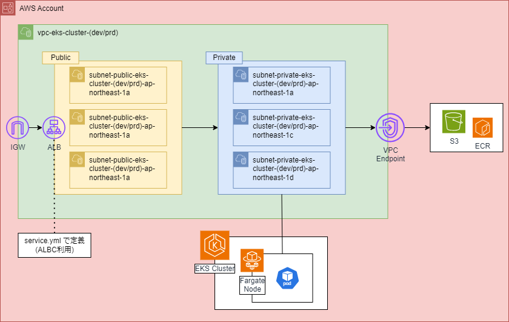

<!-- BEGIN_TF_DOCS -->
## Diagram

## Requirements

| Name | Version |
|------|---------|
|  [terraform](#requirement\_terraform) | >= 1.9.5 |
|  [aws](#requirement\_aws) | ~> 5.40 |
|  [helm](#requirement\_helm) | >= 2.12.1 |
|  [kubernetes](#requirement\_kubernetes) | ~> 2.27.0 |
|  [time](#requirement\_time) | >= 0.9 |
|  [tls](#requirement\_tls) | >= 3.0 |

## Providers

| Name | Version |
|------|---------|
|  [aws](#provider\_aws) | ~> 5.40 |
|  [helm](#provider\_helm) | >= 2.12.1 |
|  [kubernetes](#provider\_kubernetes) | ~> 2.27.0 |
|  [time](#provider\_time) | >= 0.9 |
|  [tls](#provider\_tls) | >= 3.0 |

## Modules

No modules.

## Resources

| Name | Type |
|------|------|
| [aws_cloudwatch_log_group.cluster](https://registry.terraform.io/providers/hashicorp/aws/latest/docs/resources/cloudwatch_log_group) | resource |
| [aws_ecr_pull_through_cache_rule.this](https://registry.terraform.io/providers/hashicorp/aws/latest/docs/resources/ecr_pull_through_cache_rule) | resource |
| [aws_ecr_repository.this](https://registry.terraform.io/providers/hashicorp/aws/latest/docs/resources/ecr_repository) | resource |
| [aws_ecr_repository_policy.this](https://registry.terraform.io/providers/hashicorp/aws/latest/docs/resources/ecr_repository_policy) | resource |
| [aws_eks_addon.this](https://registry.terraform.io/providers/hashicorp/aws/latest/docs/resources/eks_addon) | resource |
| [aws_eks_cluster.this](https://registry.terraform.io/providers/hashicorp/aws/latest/docs/resources/eks_cluster) | resource |
| [aws_eks_fargate_profile.this](https://registry.terraform.io/providers/hashicorp/aws/latest/docs/resources/eks_fargate_profile) | resource |
| [aws_iam_openid_connect_provider.this](https://registry.terraform.io/providers/hashicorp/aws/latest/docs/resources/iam_openid_connect_provider) | resource |
| [aws_iam_policy.albc](https://registry.terraform.io/providers/hashicorp/aws/latest/docs/resources/iam_policy) | resource |
| [aws_iam_policy.fargate](https://registry.terraform.io/providers/hashicorp/aws/latest/docs/resources/iam_policy) | resource |
| [aws_iam_role.albc](https://registry.terraform.io/providers/hashicorp/aws/latest/docs/resources/iam_role) | resource |
| [aws_iam_role.cluster](https://registry.terraform.io/providers/hashicorp/aws/latest/docs/resources/iam_role) | resource |
| [aws_iam_role.fargate](https://registry.terraform.io/providers/hashicorp/aws/latest/docs/resources/iam_role) | resource |
| [aws_iam_role_policy_attachment.albc](https://registry.terraform.io/providers/hashicorp/aws/latest/docs/resources/iam_role_policy_attachment) | resource |
| [aws_iam_role_policy_attachment.cluster](https://registry.terraform.io/providers/hashicorp/aws/latest/docs/resources/iam_role_policy_attachment) | resource |
| [aws_iam_role_policy_attachment.fargate_pod_exec](https://registry.terraform.io/providers/hashicorp/aws/latest/docs/resources/iam_role_policy_attachment) | resource |
| [aws_iam_role_policy_attachment.fargate_vpc_cni](https://registry.terraform.io/providers/hashicorp/aws/latest/docs/resources/iam_role_policy_attachment) | resource |
| [aws_internet_gateway.this](https://registry.terraform.io/providers/hashicorp/aws/latest/docs/resources/internet_gateway) | resource |
| [aws_route.public_to_igw](https://registry.terraform.io/providers/hashicorp/aws/latest/docs/resources/route) | resource |
| [aws_route_table.private](https://registry.terraform.io/providers/hashicorp/aws/latest/docs/resources/route_table) | resource |
| [aws_route_table.public](https://registry.terraform.io/providers/hashicorp/aws/latest/docs/resources/route_table) | resource |
| [aws_route_table_association.private](https://registry.terraform.io/providers/hashicorp/aws/latest/docs/resources/route_table_association) | resource |
| [aws_route_table_association.public](https://registry.terraform.io/providers/hashicorp/aws/latest/docs/resources/route_table_association) | resource |
| [aws_security_group.alb](https://registry.terraform.io/providers/hashicorp/aws/latest/docs/resources/security_group) | resource |
| [aws_security_group.eks_cluster](https://registry.terraform.io/providers/hashicorp/aws/latest/docs/resources/security_group) | resource |
| [aws_security_group.vpce](https://registry.terraform.io/providers/hashicorp/aws/latest/docs/resources/security_group) | resource |
| [aws_subnet.private](https://registry.terraform.io/providers/hashicorp/aws/latest/docs/resources/subnet) | resource |
| [aws_subnet.public](https://registry.terraform.io/providers/hashicorp/aws/latest/docs/resources/subnet) | resource |
| [aws_vpc.this](https://registry.terraform.io/providers/hashicorp/aws/latest/docs/resources/vpc) | resource |
| [aws_vpc_endpoint.this](https://registry.terraform.io/providers/hashicorp/aws/latest/docs/resources/vpc_endpoint) | resource |
| [helm_release.albc](https://registry.terraform.io/providers/hashicorp/helm/latest/docs/resources/release) | resource |
| [helm_release.metrics_server](https://registry.terraform.io/providers/hashicorp/helm/latest/docs/resources/release) | resource |
| [kubernetes_config_map.aws_auth](https://registry.terraform.io/providers/hashicorp/kubernetes/latest/docs/resources/config_map) | resource |
| [kubernetes_config_map_v1_data.aws_auth](https://registry.terraform.io/providers/hashicorp/kubernetes/latest/docs/resources/config_map_v1_data) | resource |
| [time_sleep.cluster](https://registry.terraform.io/providers/hashicorp/time/latest/docs/resources/sleep) | resource |
| [aws_caller_identity.current](https://registry.terraform.io/providers/hashicorp/aws/latest/docs/data-sources/caller_identity) | data source |
| [aws_eks_addon_version.this](https://registry.terraform.io/providers/hashicorp/aws/latest/docs/data-sources/eks_addon_version) | data source |
| [aws_iam_policy_document.cluster_assume_role_policy](https://registry.terraform.io/providers/hashicorp/aws/latest/docs/data-sources/iam_policy_document) | data source |
| [aws_iam_policy_document.fargate](https://registry.terraform.io/providers/hashicorp/aws/latest/docs/data-sources/iam_policy_document) | data source |
| [tls_certificate.this](https://registry.terraform.io/providers/hashicorp/tls/latest/docs/data-sources/certificate) | data source |

## Inputs

| Name | Description | Type | Default | Required |
|------|-------------|------|---------|:--------:|
|  [accessible\_ip\_list](#input\_accessible\_ip\_list) | アクセス許可IPリスト | <pre>object({     to_web_server      = list(string)     to_kube_api_server = list(string)   })</pre> | n/a | yes |
|  [cluster\_config](#input\_cluster\_config) | EKS クラスター設定 | <pre>object({     version                 = string     enabled_log_types       = list(string)     endpoint_private_access = bool     endpoint_public_access  = bool     addons              = any     aws_auth_roles = list(object({       rolearn  = string       username = string       groups   = list(string)     }))   })</pre> | <pre>{   "addons": {     "coredns": {       "configuration_values": {         "computeType": "Fargate"       },       "most_recent": true     },     "vpc-cni": {       "most_recent": true     }   },   "aws_auth_roles": [],   "enabled_log_types": [     "audit",     "api",     "authenticator"   ],   "endpoint_private_access": true,   "endpoint_public_access": true,   "version": "1.29" }</pre> | no |
|  [ecr\_repo\_list](#input\_ecr\_repo\_list) | ECR リポジトリリスト | `list(string)` | <pre>[   "ecr-public/eks/aws-load-balancer-controller",   "web-server",   "k8s/metrics-server/metrics-server",   "k8s/autoscaling/addon-resizer" ]</pre> | no |
|  [env](#input\_env) | 本開区分の指定(prd or dev) | `string` | n/a | yes |
|  [fargate\_profile\_config](#input\_fargate\_profile\_config) | Fargateプロファイル設定 | `any` | <pre>{   "default": {     "name": "default",     "selectors": [       {         "namespace": "default"       },       {         "namespace": "kube-system"       }     ]   },   "web-server": {     "selectors": [       {         "namespace": "web-server"       }     ]   } }</pre> | no |
|  [region](#input\_region) | リージョン | `string` | `"ap-northeast-1"` | no |
|  [subnet\_config](#input\_subnet\_config) | サブネット設定 | <pre>map(list(object({     availability_zone = string     cidr_block        = string   })))</pre> | <pre>{   "private": [     {       "availability_zone": "ap-northeast-1a",       "cidr_block": "192.168.0.0/24"     },     {       "availability_zone": "ap-northeast-1c",       "cidr_block": "192.168.1.0/24"     },     {       "availability_zone": "ap-northeast-1d",       "cidr_block": "192.168.2.0/24"     }   ],   "public": [     {       "availability_zone": "ap-northeast-1a",       "cidr_block": "192.168.3.0/24"     },     {       "availability_zone": "ap-northeast-1c",       "cidr_block": "192.168.4.0/24"     },     {       "availability_zone": "ap-northeast-1d",       "cidr_block": "192.168.5.0/24"     }   ] }</pre> | no |
|  [vpc\_config](#input\_vpc\_config) | VPC設定 | <pre>object({     cidr_block           = string     enable_dns_support   = bool     enable_dns_hostnames = bool   })</pre> | <pre>{   "cidr_block": "192.168.0.0/16",   "enable_dns_hostnames": true,   "enable_dns_support": true }</pre> | no |
|  [vpce\_config](#input\_vpce\_config) | VPCE設定リスト | <pre>list(object({     usage             = string     service_name      = string     vpc_endpoint_type = string   }))</pre> | <pre>[   {     "service_name": "com.amazonaws.ap-northeast-1.s3",     "usage": "s3",     "vpc_endpoint_type": "Gateway"   },   {     "service_name": "com.amazonaws.ap-northeast-1.ecr.api",     "usage": "ecr.api",     "vpc_endpoint_type": "Interface"   },   {     "service_name": "com.amazonaws.ap-northeast-1.ecr.dkr",     "usage": "ecr.dkr",     "vpc_endpoint_type": "Interface"   },   {     "service_name": "com.amazonaws.ap-northeast-1.sts",     "usage": "sts",     "vpc_endpoint_type": "Interface"   },   {     "service_name": "com.amazonaws.ap-northeast-1.ec2",     "usage": "ec2",     "vpc_endpoint_type": "Interface"   },   {     "service_name": "com.amazonaws.ap-northeast-1.elasticloadbalancing",     "usage": "elasticloadbalancing",     "vpc_endpoint_type": "Interface"   } ]</pre> | no |

## Outputs

| Name | Description |
|------|-------------|
|  [alb\_sg\_id](#output\_alb\_sg\_id) | webサーバーフロントALBにアタッチするセキュリティグループのID |
|  [certificate\_authority](#output\_certificate\_authority) | EKS CA |
|  [cluster\_name](#output\_cluster\_name) | EKS Cluster 名 |
|  [endpoint](#output\_endpoint) | EKS API Endpoint |
<!-- END_TF_DOCS -->
